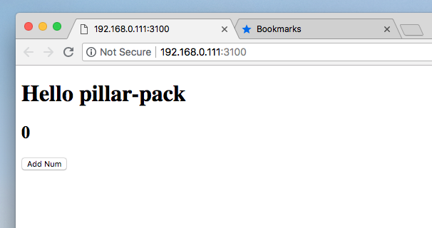

# Zero Config Parcel-pack

> Use parcel, browser-sync

[中文文档](README-CN.md)

## Why use this?

In React Project, Parcel need install `babel-*` packages, and need config `.babelrc`. And sometimes `Hot Reload` fail.
Parcel native don't have copy assets feature. So, we have this package. It's juset over parcel, wrapped up in a layer candy.

## Install

```sh
$ npm i -g pillar-pack
```

## Create a `React` project from zero

> Convention is larger than configuration

Create project
```
$ mkdir your-project
$ cd your-project
$ npm init -y
$ mkdir public src
$ touch public/index.html src/index.js
$ yarn add react react-dom
```

Now, your project frame like this, it's a defalut `React` project frame

```sh
-- public
  - index.html
-- src
  - index.js
-- package.json
```

set public/index.html

```html
<!DOCTYPE html>
<html lang="en">

<body>
  <div id="root"></div>
  <script src="bundle-rename.js"></script>
</body>

</html>
```

set src/index.js

```js
import React from 'react';
import ReactDOM from 'react-dom';

class App extends React.Component {
  state = {
    num: 0,
  };
  addNum = () => {
    this.setState({ num: this.state.num + 1 });
  };
  render() {
    return (
      <div>
        <h1>Hello pillar-pack</h1>
        <h2>{this.state.num}</h2>
        <button onClick={this.addNum}>Add Num</button>
      </div>
    );
  }
}

ReactDOM.render(<App />, document.getElementById('root'));
```

**Start:**

```sh
$ pillar-pack -s src/index.js -o build -c public
```

The project is start:



### That's all you have to do, they are do this:

1.  If no have `babel-*` packages, auto install `babel-*` packages
2.  create `.babelrc` file, and add config in it
3.  Source file from `src/index.js` or `src/index.ts`
4.  Bundle put out dir to `build`
5.  Copy `public` dir to out dir
6.  Replace in `public/index.html` string of `bundle-rename.js` to real bundle.js
7.  Use `brower-sync` start server, and replace `parcel-hmr` reload page
8.  Use system brower open page

## Default project frame

```sh
-- public
  - index.html
-- src
  - index.js
-- package.json
```

If your project is defalut `React` project frame (above paragraphs), your can just use this:

```sh
$ pillar-pack
```

---

Usually, you don't need to continue reading,unless you need to custommize some special configurations.

## Custom configuration

You can add params to change config:

```js
help list:
-s : source file
-o : set out dir
-c, --copy : set copy dir to outDir, defalut ./public
--init : Install babel-* in your project
--prod : use prod mode, only build
--cors : is use brower cors
--open : is open brower
--no-reload : set brower-sync no reload
--hmr : open hmr, defalut close
--html : set dev server html, default public/index.html
--rename : change fix bundleName, defalut bundle-rename.js
--no-copy : no copy public dir
--cover-babel : set cover babel file
--no-babel : set no create .babelrc
--source-map : true | false, defalut true
--pack : only pack js
--server : only use server
--version : cat version
```

## Example

**Install package**

```sh
$ pillar-pack init
```

**change source .js and server port**

```sh
$ pillar-pack -s src/app.js --port 4100
```

**Other custom example:**

1.  Use source file in `lib/index.js`
2.  Copy `lib/assets`
3.  Bundle out to `build-prod`
4.  Change `index.prod.html`
5.  Don't use sourceMap

```sh
$ pillar-pack \
  -s lib/index.js \
  -c lib/assets  \
  -o build-prod \
  --html index.prod.html \
  --source-map false \
  --prod
```
